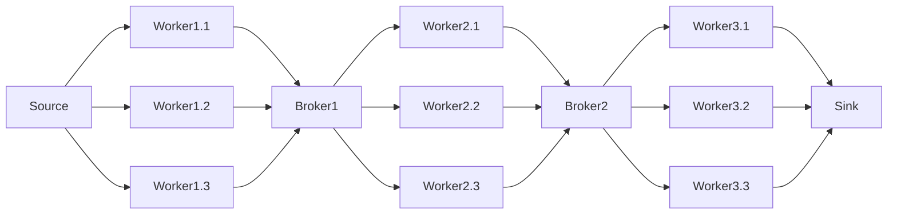

# Elixir distributed pipelines framework

This is a pseudo-framework for distributed pipelines in Elixir, highly coupled with the image processing pipeline implementation.

The pipeline is starts on a data source that send work to stages of workers, each stage connected by a broker, and ends on a sink that receives the final results.

## Reason

The main reason for this development is to be able to distribute work in a pipeline fashion in a simple manner.

The main features we found lacking in other frameworks are:

- Inability to determine the worker nodes
- Inability to do many to many communication

Which were crucial for our use case, since some architectural decisions had to be preserved.

## Architecture



The pipeline is starts on a data source that send work to stages of workers, each stage connected by a broker, and ends on a sink that receives the final results.

## Usage

### Pipeline definition

We can define the pipeline components by calling the `start_link` function on each component.
These are `GenServer` processes, so they can be started in a supervised manner.
By defining the workers input and output, we define the pipeline's topology.

```elixir
{:ok, source} = WorkSource.start_link(input_folder, batch_size)
{:ok, sink} = WorkSink.start_link()
{:ok, broker} = WorkBroker.start_link()

{:ok, worker_1_1} = Worker.start_link(worker_type, source, broker)
{:ok, worker_1_2} = Worker.start_link(worker_type, source, broker)

{:ok, worker_2_1} = Worker.start_link(worker_type, broker, sink)
{:ok, worker_2_2} = Worker.start_link(worker_type, broker, sink)
```

Then, we should call `GenServer.cast(worker, :start)` on each worker to start the pipeline.

```elixir
workers = [worker_1_1, worker_1_2, worker_2_1, worker_2_2]
Enum.each(workers, fn worker -> GenServer.cast(worker, :start) end)
```

### Distributed Deployment

In order to make the pipeline distributed, we can start the workers in different nodes using elixir's `Node` module.

For that purpouse we can define two utility functions:

`start_worker_proxy`, which is meant to run on the remote node, and will start the worker and return its pid, so that external processes can communicate with it directly.

```elixir
defmodule DistributedPipeline do
  def start_worker_proxy(worker_type, source, sink) do
    {:ok, worker_pid} = Worker.start_link(worker_type, source, sink)

    # Send worker_pid when asked for it
    receive do
      {:pid_req, ref} ->
        send ref, {:pid_res, worker_pid}
    end

    Utils.wait_for_process(worker_pid)
    {:ok, worker_pid}
  end
```

`start_remote_worker`, which is meant to run on the local node, and will start the worker on the remote node, and return its pid, so that external processes can communicate with it directly.

```elixir
defmodule DistributedPipeline do
  def start_remote_worker(worker_type, source, sink, str_remote) do
    remote = String.to_atom(str_remote)
    proxy_pid = Node.spawn_link(remote, DistributedPipeline, :start_worker_proxy, [worker_type, source, sink])

    # Request the pid of the worker from the proxy on the Node and return it
    send proxy_pid, {:pid_req, self()}
    receive do
      {:pid_res, worker_pid} ->
        {:ok, worker_pid}
    end
  end
end
```

### Worker Types - Business Logic

Worker types are modules that implement `WorkerBehaviour` and define the business logic of the pipeline of a specific worker.

The image processing pipeline implements 3 worker types: `FormatWorker`, `ResolutionWorker` and `SizeWorker`.

```elixir
defmodule WorkerBehaviour do
  @callback do_work(any()) :: any()
  @callback name() :: charlist()
end
```

`do_work` is the function that will handle a single unit of work, sending its result to the next stage of the pipeline.

`name` is the name of the worker type, used for logging and name resolution.

### Custom Workers - Extending the framework

The `BaseWorker` class implements the primitives for the worker node to communicate with the rest of the pipeline. This should be extended into custom worker archetypes to handle specific needs.

In `nodes/worker.ex` we can find the following:

- `Worker`: Simplest implementation, receives work from a source and sends it to a sink.
- `BatchedWorker`: Work is received and sent in batches, but handled individually.
- `MeasuredBatchedWorker`: Like `BatchedWorker`, but measures and logs work metrics.

## Components

### Source

### Sink

### Worker

### Broker

## Workflow

### Worker registration & un-registration

### Work pushing

### Work pulling
