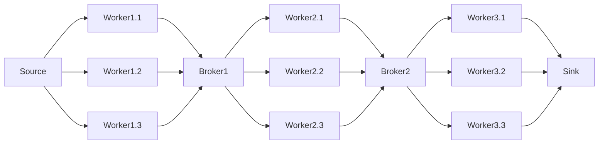

# Elixir distributed pipelines framework

This is a pseudo-framework for distributed pipelines in Elixir, highly coupled with the image processing pipeline implementation.

The pipeline is starts on a data source that send work to stages of workers, each stage connected by a broker, and ends on a sink that receives the final results.

## Reason

The main reason for this development is to be able to distribute work in a pipeline fashion in a simple manner.

The main features we found lacking in other frameworks are:

- Inability to determine the worker nodes
- Inability to do many to many communication

Which were crucial for our use case, since some architectural decisions had to be preserved.

## Architecture



The pipeline is starts on a data source that send work to stages of workers, each stage connected by a broker, and ends on a sink that receives the final results.

## Usage

### Pipeline definition

We can define the pipeline components by calling the `start_link` function on each component.
These are `GenServer` processes, so they can be started in a supervised manner.
By defining the workers input and output, we define the pipeline's topology.

```elixir
{:ok, source} = WorkSource.start_link(input_folder, batch_size)
{:ok, sink} = WorkSink.start_link()
{:ok, broker} = WorkBroker.start_link()

{:ok, worker_1_1} = Worker.start_link(worker_type, source, broker)
{:ok, worker_1_2} = Worker.start_link(worker_type, source, broker)

{:ok, worker_2_1} = Worker.start_link(worker_type, broker, sink)
{:ok, worker_2_2} = Worker.start_link(worker_type, broker, sink)
```

Then, we should call `GenServer.cast(worker, :start)` on each worker to start the pipeline.

```elixir
workers = [worker_1_1, worker_1_2, worker_2_1, worker_2_2]
Enum.each(workers, fn worker -> GenServer.cast(worker, :start) end)
```

### Distributed Deployment

In order to make the pipeline distributed, we can start the workers in different nodes using elixir's `Node` module.

For that purpouse we can define two utility functions:

`start_worker_proxy`, which is meant to run on the remote node, and will start the worker and return its pid, so that external processes can communicate with it directly.

```elixir
defmodule DistributedPipeline do
  def start_worker_proxy(worker_type, source, sink) do
    {:ok, worker_pid} = Worker.start_link(worker_type, source, sink)

    # Send worker_pid when asked for it
    receive do
      {:pid_req, ref} ->
        send ref, {:pid_res, worker_pid}
    end

    Utils.wait_for_process(worker_pid)
    {:ok, worker_pid}
  end
```

`start_remote_worker`, which is meant to run on the local node, and will start the worker on the remote node, and return its pid, so that external processes can communicate with it directly.

```elixir
defmodule DistributedPipeline do
  def start_remote_worker(worker_type, source, sink, str_remote) do
    remote = String.to_atom(str_remote)
    proxy_pid = Node.spawn_link(remote, DistributedPipeline, :start_worker_proxy, [worker_type, source, sink])

    # Request the pid of the worker from the proxy on the Node and return it
    send proxy_pid, {:pid_req, self()}
    receive do
      {:pid_res, worker_pid} ->
        {:ok, worker_pid}
    end
  end
end
```

### Worker Types - Business Logic

Worker types are modules that implement `WorkerBehaviour` and define the business logic of the pipeline of a specific worker.

The image processing pipeline implements 3 worker types: `FormatWorker`, `ResolutionWorker` and `SizeWorker`.

```elixir
defmodule WorkerBehaviour do
  @callback do_work(any()) :: any()
  @callback name() :: charlist()
end
```

`do_work` is the function that will handle a single unit of work, sending its result to the next stage of the pipeline.

`name` is the name of the worker type, used for logging and name resolution.

### Custom Workers - Extending the framework

The `BaseWorker` class implements the primitives for the worker node to communicate with the rest of the pipeline. This should be extended into custom worker archetypes to handle specific needs.

In `nodes/worker.ex` we can find the following:

- `Worker`: Simplest implementation, receives work from a source and sends it to a sink.
- `BatchedWorker`: Work is received and sent in batches, but handled individually.
- `MeasuredBatchedWorker`: Like `BatchedWorker`, but measures and logs work metrics.

## Components

### Source

The `WorkSource` module generates work units.

It is highly coupled with the image processing pipeline, since it generates work units from images in a folder.

It is also coupled with the `BatchedWorker` archetype, since it generates batches of work units.

The source implements `handle_cast {:ready, pid}`,

- Sending `{:work, serving_files} if there are files to process.
- Sending `:no_work` if there are no more files left.

### Sink

The `WorkSink` module receives work units at the end of the pipeline, not propagating them further.

It is coupled with the `BatchedWorker` archetype, since it receives batches of work units.

The sink implements:

- `handle_call :request_receiver`: Which returns `self()`, as it is called when a worker has work to push, and the sink has no further stages to push to.
- `handle_cast {:work, work}`: Which receives work units and just keeps a count of them.
- `handle_call :register_worker`: Which registers the worker pid, so that it can keep track of the end of work.
- `handle_call :unregister_worker`: Which is called when a worker has finished its work. When all workers have finished, the pipeline is considered finished.

### Worker

The `Worker` module implements the `BaseWorker` behaviour, and is the simplest worker archetype.

It takes care of the communication protocol side of the worker node, calling upon the worker type to handle the work unit.

Its main flow is:

- Marking itself as ready to do work
- Receiving and handling work
  - If possible, pushing it to the next stage
  - Else, queuing the result
  - Then start again (if the result queue is not full)

Thus not saturating the posterior stages of the pipeline (as they have to be ready), but still keeping the worker busy until its result queue is full.

The worker implements:

- `handle_cast {:work, work}`: Which is the main flow of the worker.
- `handle_cast :no_work`: Which is received when the source has no more work to send, and propagates it to the next stage.
- `def handle_cast {:get_work, pid}`: Which is received when there is queued work that can be pushed to the next stage.

### Broker

The `WorkBroker` module functions as a queue between stages of the pipeline, being a source and a sink at the same time.

It keeps state both for `workers_with_pending_results` and `workers_ready_for_work`.
If the first queue has elements, the stage works in a pull fashion, asking for work from the previous stage.
If the second queue has elements, the stage works in a push fashion, sending work to the next stage.
Both queues can not have elements at the same time, since it makes no sense to fill one if the other can be emptied.

The broker implements:

- `handle_call:register_worker` and `handle_call:unregister_worker`: Which are similar to the ones at the sink, save for the need to propagate the end of work.
- `handle_cast {:ready, pid}`: To act as a source, sending work to the next stage.
  - If there are `workers_with_pending_results` it will call on them
  - Else, it will add the worker to `workers_ready_for_work`
- `handle_call :request_receiver`: To act as a sink, receiving work from the previous stage.
  - If there are `workers_ready_for_work` it pass their pid
  - Else, it will add the worker to `workers_with_pending_results` and answer `:unavailable`

## Workflow

### Worker registration & un-registration

### Work pushing

### Work pulling
