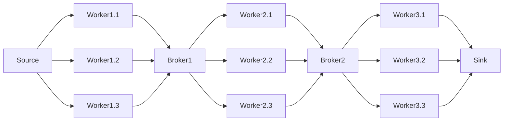
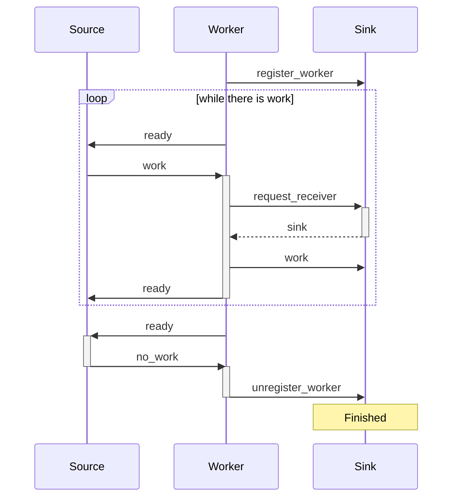
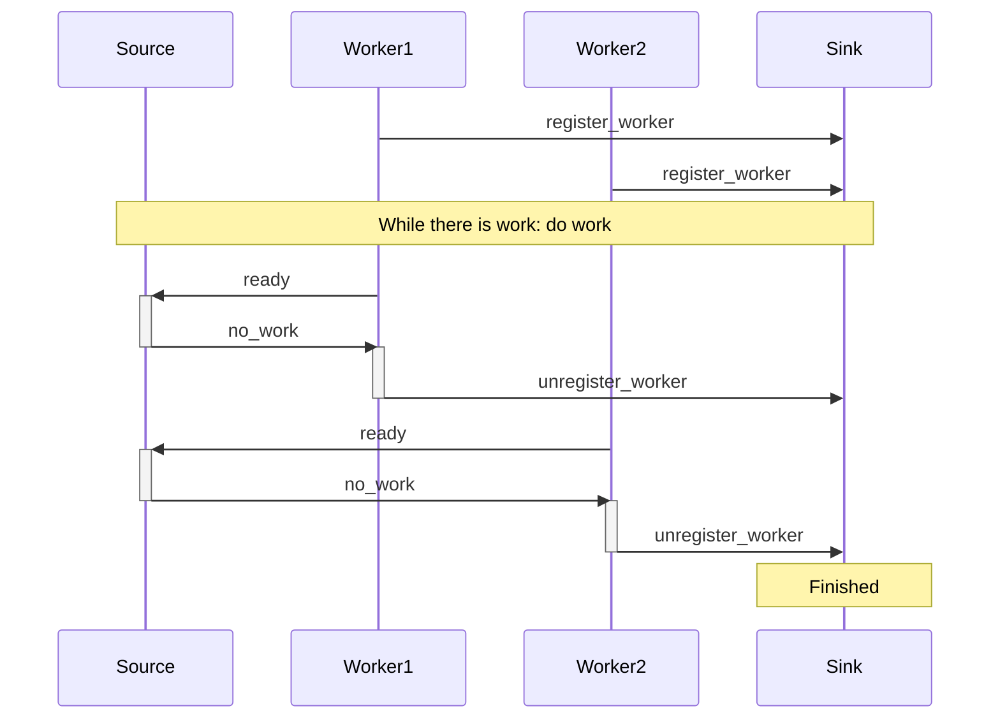
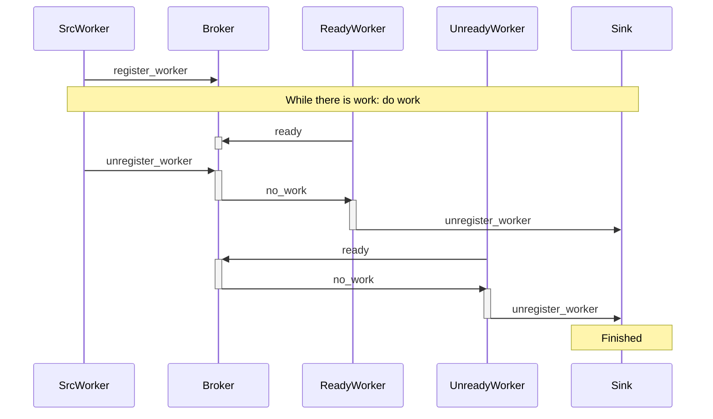
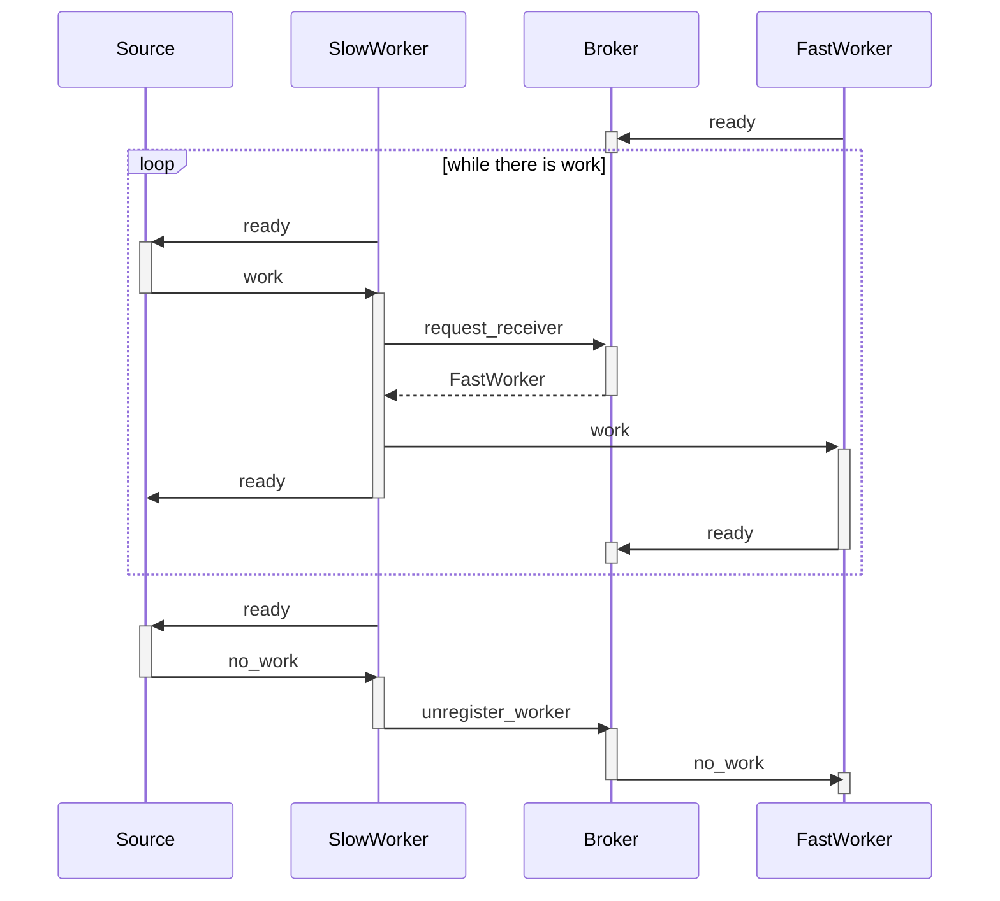
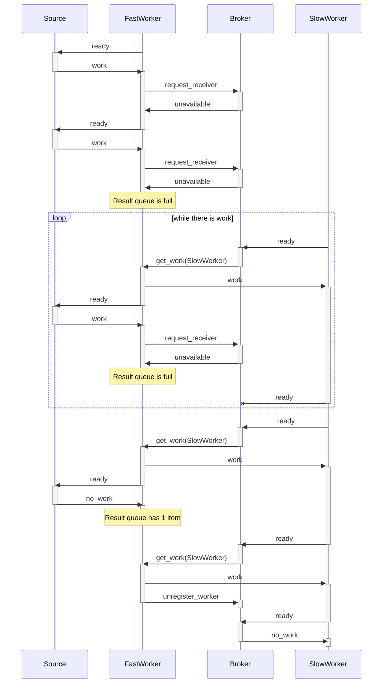

# Elixir distributed pipelines framework

This is a pseudo-framework for distributed pipelines in Elixir. Using Elixir native capabilities and Docker Swarm.

The pipeline is starts on a data source that send work to stages of workers, each stage connected by a broker, and ends on a sink that receives the final results.

## Reason

The main reason for this development is to be able to distribute work in a pipeline fashion in a simple manner.

Unable to find a framework that suited my needs, I decided to develop my own.

## Architecture



The pipeline is starts on a data source that send work to stages of workers, each stage connected by a broker, and ends on a sink that receives the final results.

## Usage

### Deployment

- The project already has a pipeline with 3 steps of workers that do image transformations.

- For such use case, 2 external libraries are being used

  - `image`: (imported with hex)
  - `dir_walker`: copied into utils

- The project is deployed using docker swarm, `docker swarm init` initializes it.

- To run the system, we can:
  - Use `make iex` to deploy the system and open an iex session on the manager node. It is equivalent to:
    - `make setup` will make other required initializations: Creates required folders and gives scripts permissions.
    - `make clean_local_deploy` will remove old containers and deploy the system, waiting for the services to be ready.
    - `make manager_iex` will open an iex session on the manager node.
  - Run `DistributedPipeline.main` (on iex) to start the pipeline.

> You might find unused logging capabilities in the code.
> These are left from the original project where some metrics are logged using statsd.
> I've left them since they show how the framework can be extended.

### Pipeline definition

We can define the pipeline components by calling the `start_link` function on each component.
These are `GenServer` processes, so they can be started in a supervised manner.
By defining the workers input and output, we define the pipeline's topology.

```elixir
{:ok, source} = WorkSource.start_link(input_folder, batch_size)
{:ok, sink} = WorkSink.start_link()
{:ok, broker} = WorkBroker.start_link()

{:ok, worker_1_1} = Worker.start_link(worker_type, source, broker)
{:ok, worker_1_2} = Worker.start_link(worker_type, source, broker)

{:ok, worker_2_1} = Worker.start_link(worker_type, broker, sink)
{:ok, worker_2_2} = Worker.start_link(worker_type, broker, sink)
```

Then, we should call `GenServer.cast(worker, :start)` on each worker to start the pipeline.

```elixir
workers = [worker_1_1, worker_1_2, worker_2_1, worker_2_2]
Enum.each(workers, fn worker -> GenServer.cast(worker, :start) end)
```

### Distributed Deployment

In order to make the pipeline distributed, we can start the workers in different nodes using elixir's `Node` module.

For that purpouse we can define two utility functions:

`start_worker_proxy`, which is meant to run on the remote node, and will start the worker and return its pid, so that external processes can communicate with it directly.

```elixir
defmodule DistributedPipeline do
  def start_worker_proxy(worker_type, source, sink) do
    {:ok, worker_pid} = Worker.start_link(worker_type, source, sink)

    # Send worker_pid when asked for it
    receive do
      {:pid_req, ref} ->
        send ref, {:pid_res, worker_pid}
    end

    Utils.wait_for_process(worker_pid)
    {:ok, worker_pid}
  end
```

`start_remote_worker`, which is meant to run on the local node, and will start the worker on the remote node, and return its pid, so that external processes can communicate with it directly.

```elixir
defmodule DistributedPipeline do
  def start_remote_worker(worker_type, source, sink, str_remote) do
    remote = String.to_atom(str_remote)
    proxy_pid = Node.spawn_link(remote, DistributedPipeline, :start_worker_proxy, [worker_type, source, sink])

    # Request the pid of the worker from the proxy on the Node and return it
    send proxy_pid, {:pid_req, self()}
    receive do
      {:pid_res, worker_pid} ->
        {:ok, worker_pid}
    end
  end
end
```

### Worker Types - Business Logic

Worker types are modules that implement `WorkerBehaviour` and define the business logic of the pipeline of a specific worker.

The image processing pipeline implements 3 worker types: `FormatWorker`, `ResolutionWorker` and `SizeWorker`.

```elixir
defmodule WorkerBehaviour do
  @callback do_work(any()) :: any()
  @callback name() :: charlist()
end
```

`do_work` is the function that will handle a single unit of work, sending its result to the next stage of the pipeline.

`name` is the name of the worker type, used for logging and name resolution.

### Custom Workers - Extending the framework

The `BaseWorker` class implements the primitives for the worker node to communicate with the rest of the pipeline. This should be extended into custom worker archetypes to handle specific needs.

In `nodes/worker.ex` we can find the following:

- `Worker`: Simplest implementation, receives work from a source and sends it to a sink.
- `BatchedWorker`: Work is received and sent in batches, but handled individually.
- `MeasuredBatchedWorker`: Like `BatchedWorker`, but measures and logs work metrics.

## Components

### Source

The `WorkSource` module generates work units.

It is highly coupled with the image processing pipeline, since it generates work units from images in a folder.

It is also coupled with the `BatchedWorker` archetype, since it generates batches of work units.

The source implements `handle_cast {:ready, pid}`,

- Sending `{:work, serving_files}` if there are files to process.
- Sending `:no_work` if there are no more files left.

### Sink

The `WorkSink` module receives work units at the end of the pipeline, not propagating them further.

It is coupled with the `BatchedWorker` archetype, since it receives batches of work units.

The sink implements:

- `handle_call :request_receiver`: Which returns `self()`, as it is called when a worker has work to push, and the sink has no further stages to push to.
- `handle_cast {:work, work}`: Which receives work units and just keeps a count of them.
- `handle_call :register_worker`: Which registers the worker pid, so that it can keep track of the end of work.
- `handle_call :unregister_worker`: Which is called when a worker has finished its work. When all workers have finished, the pipeline is considered finished.

### Worker

The `Worker` module implements the `BaseWorker` behaviour, and is the simplest worker archetype.

It takes care of the communication protocol side of the worker node, calling upon the worker type to handle the work unit.

Its main flow (push) is:

- Marking itself as ready to do work
- Receiving and handling work
  - If possible, pushing it to the next stage
  - Else, queuing the result
  - Then start again (if the result queue is not full)

But work can also be pulled:

- Receiving a get_work message
  > This should only happen if there is queued work, as the worker keeps track of it
- Sending queued work to the next stage
- If it is not 'done' and it just freed the queue (queue has 1 space left), mark as ready
- If it is 'done' and there is no more queued work, unregister the worker

> A worker is 'done' when it has received a `no_work` message from the source.

Thus not saturating the posterior stages of the pipeline (as they have to be ready), but still keeping the worker busy until its result queue is full.

The worker implements:

- `handle_cast {:work, work}`: Which is the main flow of the worker.
- `handle_cast :no_work`: Which is received when the source has no more work to send, and propagates it to the next stage.
- `def handle_cast {:get_work, pid}`: Which is received when there is queued work that can be pushed to the next stage.

### Broker

The `WorkBroker` module functions as a queue between stages of the pipeline, being a source and a sink at the same time.

It keeps state both for `workers_with_pending_results` and `workers_ready_for_work`.
If the first queue has elements, the stage works in a pull fashion, asking for work from the previous stage.
If the second queue has elements, the stage works in a push fashion, sending work to the next stage.
Both queues can not have elements at the same time, since it makes no sense to fill one if the other can be emptied.

The broker implements:

- `handle_call:register_worker` and `handle_call:unregister_worker`: Which are similar to the ones at the sink, save for the need to propagate the end of work.
- `handle_cast {:ready, pid}`: To act as a source, sending work to the next stage.
  - If there are `workers_with_pending_results` it will call on them
  - Else, it will add the worker to `workers_ready_for_work`
- `handle_call :request_receiver`: To act as a sink, receiving work from the previous stage.
  - If there are `workers_ready_for_work` it pass their pid
  - Else, it will add the worker to `workers_with_pending_results` and answer `:unavailable`

## Workflow

### Worker registration & un-registration

#### Base workflow

When workers start, they register themselves to the sink, and then enter a loop where they ask for work until there is no more work to do, at which point they unregister themselves.



#### Multiple workers

When all workers registered to a sink have unregistered, it considers the pipeline finished.



#### Brokers

Brokers act as both sources and sinks, so they have to both handle both handle registration and un-registration, and propagate them to the next stage.

The next stage can have 2 types of workers:

- Ready workers, that are ready to receive work: these will be sent `no_work` as soon as all previous stages have finished.
- Unready workers, that are still working: these will be sent `no_work` when they ask for more work.

Brokers themselves don't finish, it is the sink which signals the end of the pipeline, and triggers the cleanup process of nodes.



### Work pushing

When the posterior stage is faster, and thus ready to receive work, the previous workers can push work to it.



This workflow is preferred, since it involves less message passing and state. But in a real scenario we cam expect both push and pulling behaviors to be interleaved and change over time.

### Work pulling

When the posterior stage is slower, and thus not ready to receive work, the previous workers can queue work for it, which will be pulled when the stage is ready.


